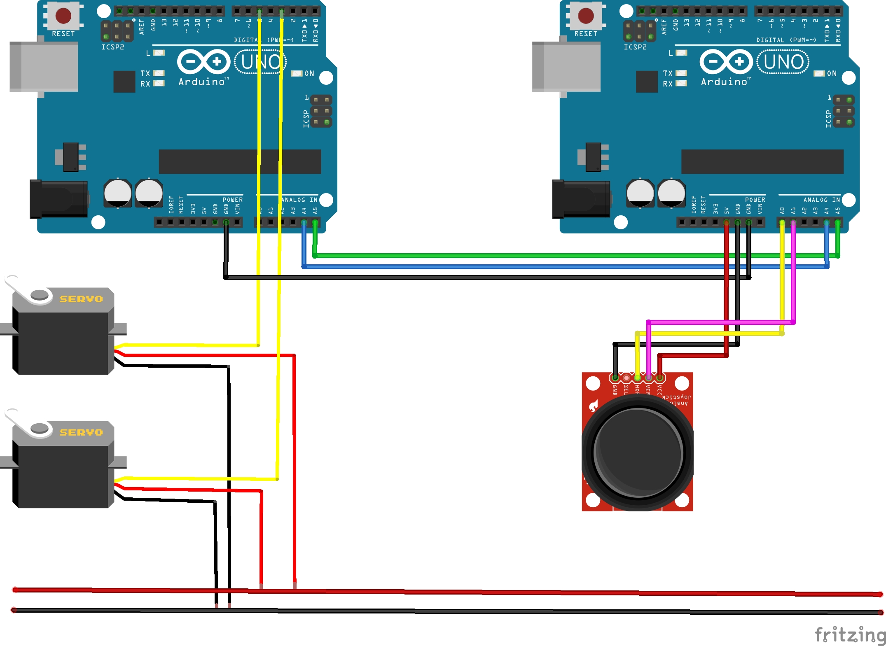

# Robot-arm

### Master

Il master scrive sullo slave: corrisponde all'arduino che legge i valori dei joystick e dei sensori.

### Slave

Lo slave riceve in ingresso i valori dal master e reagisce di conseguenza portando in posizione i servo.

